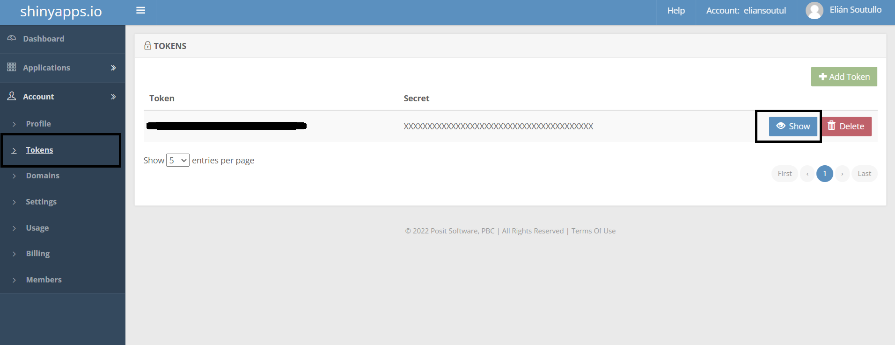
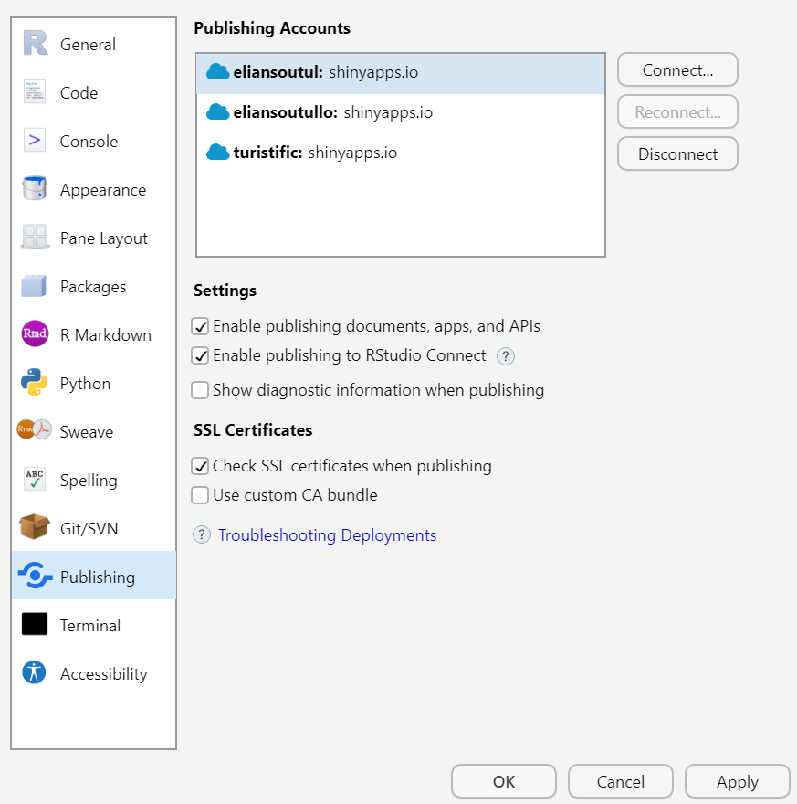
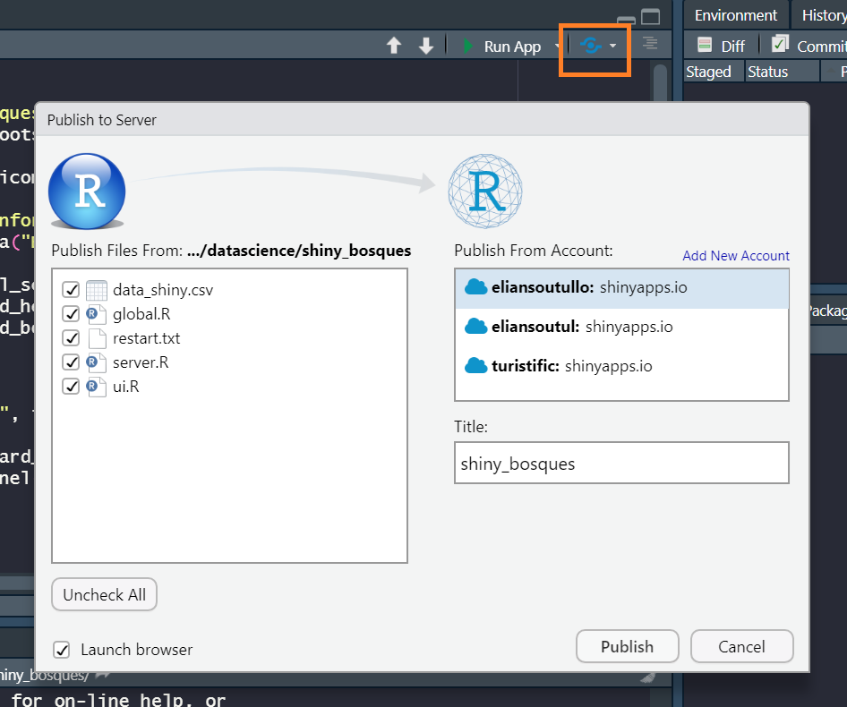
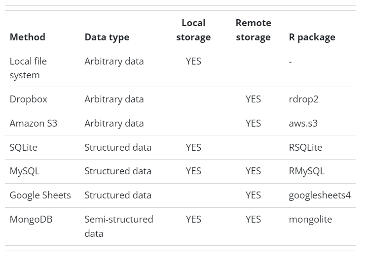

```{r include=FALSE}
knitr::opts_chunk$set(echo = FALSE, message = FALSE, warning = FALSE)
```

class: center, middle inverse

# Deploy

---

# Deploy

El *deploy* (despliegue) de una Shiny es el último paso para poder compartir nuestra app con otras personas. Necesitamos contar con un servidor acorde para poder alojar nuestra aplicación, es decir, un sistema que pueda ejecutar R y Shiny, con todas sus dependencias.

En resumen necesitamos un [Shiny Server](https://posit.co/products/open-source/shinyserver/), una herramienta de código abierto para alojar múltiples aplicaciones en un solo lugar.


.pull-left[
```{r}
knitr::include_graphics("recursos/servidor.jpg")
```

]


.pull-right[
```{r out.width="60%"}
knitr::include_graphics("recursos/linux.png")
```

]

---

# Deploy

<br>

¿Qué opciones tenemos para desplegar una app?

--

- [Posit Connect](https://posit.co/products/enterprise/connect/)

--

- [Shiny Server](https://posit.co/download/shiny-server/)

--

- [shinyapps.io](https://www.shinyapps.io/)

---

# ¿Fuera del server?

<br>

Otros caminos (experimentales) para compartir nuestra app:

- Local:

 - Scripts de código (¿+ git?): para users de R
 - Compilar como app desktop con R portable (ej: [DesktopDeployR](https://github.com/wleepang/DesktopDeployR), [RInno](https://github.com/ficonsulting/RInno))

--

- Web:

 - [Shinylive](https://posit-dev.github.io/r-shinylive/) + [webR](https://docs.r-wasm.org/webr/latest/)

--

- No Shiny:
 
 - Se puede combinar Rmarkdown o Quarto con paquetes de R para hacer app "estáticas" sencillas. Ej: `flexdashboard` + `crosstalk`

---

# Volviendo a Shiny Server...

<br>

shinyapps.io ofrece una opción gratuita (limitada) para hacer el deploy de nuestra app.

Pasos:

1. Crear una cuenta https://www.shinyapps.io/

2. Generar un token

3. Vincular la cuenta desde Rstudio

4. Publicar la aplicación

---

# Deploy

2- Token

```{r out.width="100%"}

```

---

# Deploy

3- Conexión

```{r out.width="60%"}

```

---

# Deploy

4- Publicación

```{r out.width="60%"}

```

---

# Deploy

<br>

¡Voilá!

```{r out.width="100%"}
knitr::include_graphics("recursos/shinyapps_deployed.png")
```

---

class: center, middle inverse

# Buenas prácticas

---

# Buenas prácticas

<br>

--

- Funcionalizar, modularizar, paquetizar

--

- Pre-procesar los datos fuera de la app

--

- Minimizar la reactividad: lógica app vs negocio

--

- Documentar y comentar el código

--

- Controlar los paquetes y sus versiones ([renv](https://rstudio.github.io/renv/articles/renv.html))

--

- Utilizar control de versiones

--

- Testing ([shinytest2](https://github.com/rstudio/shinytest2), [testthat](https://testthat.r-lib.org/index.html), [shinyloadtest](https://rstudio.github.io/shinyloadtest/)) - Profiling([profvis](https://rstudio.github.io/profvis/))

---

# Bases de datos e integración

Local vs Remoto

```{r out.width="80%"}

```

https://shiny.posit.co/r/articles/build/persistent-data-storage/

---

# Ejemplos

Probemos distintos enfoques para leer y procesar nuestros datos sobre bosques usados en el taller.

```{r}
library(tictoc)
library(tidyverse)
```

¿Cuánto tarda el proceso de limpieza de datos que hicimos?

`recursos/data/limpieza.R`

```{r}
tic()

#Cargo datos
data_sq <- read_csv("recursos/data/API_AG.LND.FRST.K2_DS2_en_csv_v2_47369.csv",skip = 3)
data_porc <- read_csv("recursos/data/API_AG.LND.FRST.ZS_DS2_en_csv_v2_212991.csv", skip = 3)

#Cargo metadata para agregar region
meta <- read_csv("recursos/data/Metadata_Country_API_AG.LND.FRST.K2_DS2_en_csv_v2_47369.csv") %>% 
  select(1, 2) %>% 
  janitor::clean_names()

#Limpiamos datos
data_porc <- data_porc %>% 
  janitor::clean_names() %>% 
  pivot_longer(x1960:x2023, names_to = "anio", values_to = "valor") %>% 
  drop_na(valor) %>% 
  select(-c(indicator_code, x69)) %>% 
  mutate(anio = parse_number(anio),
         indicator_name = "Cobertura")

data_sq <- data_sq %>% 
  janitor::clean_names() %>% 
  pivot_longer(x1960:x2023, names_to = "anio", values_to = "valor") %>% 
  drop_na(valor) %>% 
  select(-c(indicator_code, x69)) %>% 
  mutate(anio = parse_number(anio),
         indicator_name = "Superficie")

#Unimos bases y nos quedamos solo con registros de países
data_join <- bind_rows(data_sq, data_porc) %>% 
  left_join(meta) %>% 
  drop_na(region)

toc()
```

---

# Ejemplos

¿Y cuánto demora leer los datos?

.xlsx
```{r echo=TRUE}
tic()
xlsx <- readxl::read_excel("recursos/data/data_shiny.xlsx")
toc()
```

```{r include=FALSE}
gc()
```

.csv
```{r echo=TRUE}
tic()
csv <- read.csv("recursos/data/data_shiny.csv")
toc()

```

```{r include=FALSE}
gc()
```

---

# Ejemplos

.parquet
```{r echo=TRUE}
tic()
parquet <- arrow::open_dataset("recursos/data/data_shiny.parquet")
toc()
```

```{r include=FALSE}
gc()
```

.db
```{r echo=TRUE}
tic()
db <- DBI::dbConnect(RSQLite::SQLite(), "recursos/data/data_shiny.db")
toc()
```

---

# Peso de los objetos

```{r}
paste("xlsx", object.size(xlsx))
paste("csv", object.size(csv))
paste("parquet", object.size(parquet))
paste("db", object.size(db))
```

---

# Recursos 

<br>

- [Optimización - repo latin-r](https://github.com/Appsilon/latin-r-2024)

- [Blog - opciones de deploy](https://www.appsilon.com/post/r-shiny-deployment)

- [Shiny without boundaries - repo deploy](https://github.com/coatless-talks/stat447-shiny-without-boundaries-one-app-multiple-destinations)

- [`golem`](https://engineering-shiny.org/golem.html) o [`Rhino`](https://appsilon.github.io/rhino/) para modularizar

- [Shiny code explained](https://hypebright.nl/en/home-en/blog/)