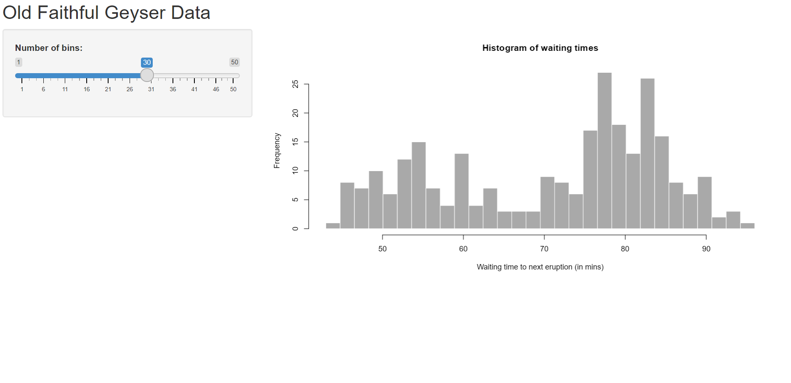

```{r include=FALSE}
knitr::opts_chunk$set(echo = FALSE)
```

# Presentación del curso

<br>
<br>

1. Introducción al paquete Shiny

 - Si R es un universo, Shiny es una galaxia
 - Shiny base + librerías complementarias

--

2. Funcionamiento de una Shiny app (Server + UI)

--

3. Programación de una app -> reactividad

--

4. Compartir una app

--

<br>

Resultado esperado: **programar una app propia**

---

# Presentación personal

<br>
<br>

[Link](https://docs.google.com/spreadsheets/d/1r8JgMcdZ62ZsWmyqcGCQkv43onpbTMCnqiFr16FDW0U/edit?hl=es#gid=0)

- Nombre

- Lugar de residencia

- Profesión/cargo

- Temás de interés/idea de app

- Expectativas

--

<br>

Nuestra primera app: `shiny_presentacion/app.R`

---

class: center, middle

```{r out.width="60%"}
knitr::include_graphics("recursos/shiny.png")
```

[https://shiny.posit.co/](https://shiny.posit.co/)

---

# ¿Qué es Shiny?
<br>
<br>
--

- Una librería para desarrollar aplicaciones web

--

 - **R** y Python

--

- No requiere conocimiento de otros lenguajes

--

- Útil para compartir resultados con otras personas

--

 - Ciencia de datos
 - Interactividad

--

- Personalización

---

# Un *dashboard*

<iframe width="100%" height="400" src="https://gallery.shinyapps.io/nz-trade-dash/"></iframe>

[https://gallery.shinyapps.io/nz-trade-dash/](https://gallery.shinyapps.io/nz-trade-dash/)

---

# Más allá de un *dashboard*, un sitio web

<iframe width="100%" height="400"
  src="https://friss.shinyapps.io/shiny-vue-r/#/">
</iframe>

[https://friss.shinyapps.io/shiny-vue-r/#/](https://friss.shinyapps.io/shiny-vue-r/#/)

---
# Más allá de un sitio web, un juego

<iframe width="100%" height="400"
  src="https://dreamrs.shinyapps.io/memory-hex/">
</iframe>

[https://dreamrs.shinyapps.io/memory-hex/](https://dreamrs.shinyapps.io/memory-hex/)

---

# Más allá de un juego, un programa

<iframe width="100%" height="400"
 src="https://rpodcast.shinyapps.io/shinylego/">
</iframe>

[https://rpodcast.shinyapps.io/shinylego/](https://rpodcast.shinyapps.io/shinylego/)

Otro ejemplo: [mapeAr](https://tableros.yvera.tur.ar/mapeAr)

---

# Para seguir explorando...

<br>
<br>

[Galería Shiny](https://shiny.posit.co/r/gallery/)

[Shiny Contest](https://forum.posit.co/tag/shiny-contest)

[Appsilon](https://www.appsilon.com/shiny-demo-gallery)

---

class: center, middle inverse

# Arquitectura de una Shiny

---

# Arquitectura de una Shiny

```{r out.width="100%"}
knitr::include_graphics("recursos/what_is_shiny.png")
```


---

# UI

<br>
<br>

- ### Visible

- ### Lado del cliente (navegador)

- ### Parte estética

- ### Frontend: HTML, CSS, Javascript

---

# UI


## Lo que vemos

<br>

```{r out.width="100%", warning=FALSE}


library(shiny)

ui <- fluidPage(

    # Un título
    titlePanel("Old Faithful Geyser Data"),

    # Un slider (input)
    sliderInput("bins", "Number of bins:", min = 1, max = 50, value = 30),

    # Una salida de  (output)
    plotOutput("distPlot") 
     
)

```

---

## Lo que sucede

```{r comment=NA}
cat(as.character(ui))
```

---

## Lo que escribimos

```
library(shiny)

ui <- fluidPage(

    # Un título
    titlePanel("Old Faithful Geyser Data"),

    # Un slider (input)
    sliderInput("bins", "Number of bins:", min = 1, max = 50, value = 30),

    # Una salida de gráfico (output)
    plotOutput("distPlot") 
     
)


```
---

# UI

<br>

En la UI o "Interfaz de Usuario" definimos el contenido de nuestra aplicación: su estructura, organización de los elementos, sus estilos y formatos. Podemos utilizar funciones de *Shiny* para construir nuestra UI, las cuales van a traducirse en HTML, CSS y JS.

<br>

--

- ¿Cuántas secciones va a tener mi app? 

- ¿Cómo se va a llamar?

- ¿Qué visualizaciones voy a usar (gráficos, tablas, etc.)? ¿Dónde va a ir cada una?

- ¿Qué elementos van a ser interactivos?

- ¿Cómo va a lucir mi app?

- ¿Va a ser dinámica?

---

# Server

<br>
<br>

- ### Oculto

- ### Lado del proveedor/hosting

- ### Parte funcional

- ### Backend: R

---

# Server

## Lo que escribimos

```
server <- function(input, output) {

    output$distPlot <- renderPlot({
        x    <- faithful[, 2]
        bins <- seq(min(x), max(x), length.out = input$bins + 1)

        hist(x, breaks = bins, col = 'darkgray', border = 'white',
             xlab = 'Waiting time to next eruption (in mins)',
             main = 'Histogram of waiting times')
    })
}

```

---

# Server

<br>

En el server definimos la lógica de nuestra app: es donde sucede la magia. Acá escribimos nuestro código de R, ayudándonos de funciones específicas de Shiny para controlar los procesos internos, las entradas y las salidas.

<br>

--

- ¿Qué datos voy a mostrar?

- ¿Qué información le voy a pedir al usuario?

- ¿Cuándo se va a ejecutar determinado proceso?

- ¿Qué tipo de tablas o gráfico voy a mostrar?

- ¿Cómo se relacionan los elementos de mi app?

- ¿Qué debería pasar cuando el usuario haga *click* en un botón?

---

# UI + Server

Son procesos que suceden en simultáneo y que están en comunicación

```{r out.width="100%"}
knitr::include_graphics("recursos/what_is_shiny.png")
```

---

# Crear una Shiny

<br>
<br>

- Instalar shiny: `install.packages("shiny")`
 
 - Como archivo: `New file > Shiny Web App > single file o multiple`
 - Como proyecto: `New Project > Shiny Application`

Como recomendación, nuestra Shiny app debería ser un proyecto en sí mismo, que contenga todos, y únicamente, los scripts y archivos necesarios para su funcionamiento.

--

### ¡Vamos a Rstudio!
