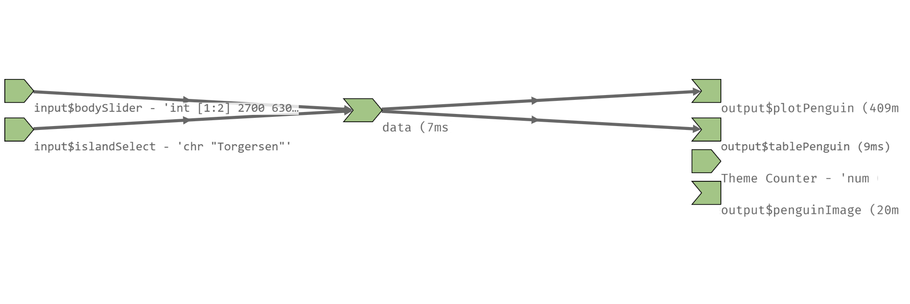

```{r include=FALSE}
knitr::opts_chunk$set(echo = FALSE)
```

class: center, middle inverse

# Reactividad

---

# Reactividad

La **programación reactiva** es un paradigma que se centra en la idea de valores que cambian con el tiempo y en procesos y acciones que reaccionan a esos valores (**dependencia**). Esto es central en Shiny dado que, como vimos, queremos que nuestros usuarios interactúen con la app cambiando valores de los inputs para que modifiquen los outputs.

La reactividad en Shiny tiene además una propiedad denominada **lazyness** ("pereza") que determina que el código se ejecutará cuando es necesario. Esto difiere del código R al que estamos acostumbrados, el cual se lee y ejecuta de arriba a abajo.

---

# Reactividad

<br>

Recordemos el render en el server de nuestra app de pingüinos:

```
output$plotPenguin <- renderPlotly({
    
    data <- penguins %>% 
      filter(island == input$islandSelect,
             body_mass_g >= input$bodySlider[1] & body_mass_g <= input$bodySlider[2])
    
    plot <- ggplot(data, aes(bill_length_mm, bill_depth_mm, color = species)) +
      geom_point() + theme_minimal()
      
    ggplotly(plot)
  })
```
---

# Reactividad

Las funciones de render son reactivas, por lo que al cambiar el valor de los inputs nuestro gráfico se actualiza. 

¿Qué sucede si creamos el objeto `data` fuera del render?

```
server <- function(input, output, session) {

  data <- penguins %>% 
   filter(island == input$islandSelect,
          body_mass_g >= input$bodySlider[1] & body_mass_g <= input$bodySlider[2])
             
  output$plotPenguin <- renderPlotly({

    plot <- ggplot(data, aes(bill_length_mm, bill_depth_mm, color = species)) +
      geom_point() + theme_minimal()
    
    ggplotly(plot)
  })
}
```
---

# Reactividad

### ¿Cómo manejar la reactividad de una app?

Una **expresión reactiva** es aquella que lee un input y devuelve un valor, el cual se actualizará cada vez que cambie el input original. Es decir, que se caracteriza por almacenar en caché sus valores y saber cuándo estos han quedado obsoletos.

Las expresiones reactivas sirven para:

- Reducir la cantidad de cálculos de la Shiny

- Hacer la app más eficiente y más fácil de entender para las personas 

- Reducir la duplicidad


https://shiny.posit.co/r/getstarted/build-an-app/images/reactive-flow-simple.png

---

# Reactividad

Con esta idea, podemos modificar nuestro código del server con una expresión reactiva, la cual escribimos con la función `reactive()`

```
server <- function(input, output, session) {

  data <- reactive({
    penguins %>% 
      filter(island == input$islandSelect,
             body_mass_g >= input$bodySlider[1] & body_mass_g <= input$bodySlider[2])
  })
  
  output$plotPenguin <- renderPlotly({

    plot <- ggplot(data(), aes(bill_length_mm, bill_depth_mm, color = species)) +
      geom_point() + theme_minimal()
    
    ggplotly(plot)
  })
}
```
**Nótese el llamado a nuestro objeto reactivo con ()**

---

# Reactividad

Lo útil de crear el reactivo `data()` es que podemos utilizarlo en otras secciones de la app. Por ejemplo, si queremos agregar una tabla debajo del gráfico no necesitamos volver a filtrar los datos, solo llamar al mismo objeto que utiliza el gráfico.

```
server <- function(input, output, session) {

  data <- reactive({ penguins %>% 
      filter(island == input$islandSelect,
             body_mass_g >= input$bodySlider[1] & body_mass_g <= input$bodySlider[2])
  })
  
  output$plotPenguin <- renderPlotly({
  
    plot <- ggplot(data(), aes(bill_length_mm, bill_depth_mm, color = species)) +
      geom_point() + theme_minimal()
    ggplotly(plot)
  })
  
  output$tablePenguin <- renderTable({data()})
}
```

---

# Reactividad

### Funciones para trabajar la reactividad:

**reactive()**

eventReactive() / bindEvent()

observe()

observeEvent() / bindEvent()

reactiveVal()

reactiveValues()

isolate()

---

# Reactividad

### ¿Cómo entender la reactividad de una app?

Para comprender mejor los reactivos y el orden de ejecución de nuestra app, se debe mirar el gráfico de reactividad, el cual describe cómo se conectan los inputs y outputs, es decir, brinda una idea de las dependencias de nuestro código.

```{r out.width="65%", fig.align='center'}
knitr::include_graphics("recursos/reactivity-graph.png")
```

Fuente: https://rstudio.github.io/reactlog/articles/reactlog.html

---

# Reactividad

Para poder visualizar el gráfico de nuestra app (y no volvernos locos dibujando), podemos utilizar el paquete [`reactlog`](https://rstudio.github.io/reactlog/)

```
library(shiny)
library(reactlog)

# activar reactlog
reactlog_enable()

# correr shiny
runApp(app)

# mostrar gráfico (una vez cerrada la app)
shiny::reactlogShow()
```
o
```
options(shiny.reactlog = TRUE)
Ctrl + F3
```
---

# Reactividad

<br>

Así luce el gráfico de nuestra app de Palmer Penguins



`penguin_app/`

---

# Ejercicios

<br>

`ejercicios/app1.R`: 

- Escribir el código de una Shiny para visualizar el dataset de Iris. Reemplazar todos los espacios con "..."

- Generar el gráfico de reactividad de la app

`ejercicios/app2.R`:

- Debuggear la app con errores que intenta mostrar un texto y una tabla filtrada de acuerdo a la especie de Iris seleccionada

---

# Recursos adicionales

Para consultar:

[Shiny lessons](https://shiny.posit.co/r/getstarted/shiny-basics/lesson6/)

Mastering Shiny [Cap 3](https://mastering-shiny.org/basic-reactivity.html) y [Caps 13-16](https://mastering-shiny.org/reactivity-intro.html)

[Building Web Apps with R Shiny](https://debruine.github.io/shinyintro/reactives.html)

<br>

Para explorar recursos:

[Awesome Shiny](https://github.com/nanxstats/awesome-shiny-extensions)