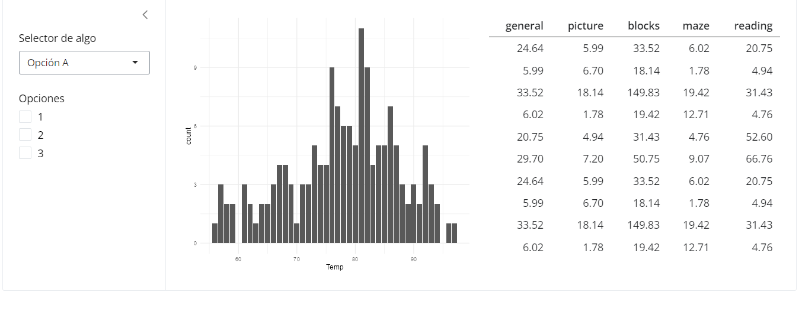

```{r include=FALSE}
knitr::opts_chunk$set(echo = FALSE)
```

class: center, middle inverse

# Server

---

# Server


El servidor es el que le da vida a nuestra app: todos los inputs y outputs que creamos requieren de algo que los una y renderice para que sean funcionales. Como la UI, el server también se construye como una función:

```
server <- function(input, output, session) {...}
```

donde

- `input` es el parámetro que nos permite acceder a los valores de los inputs definidos en la UI, es decir, que el servidor puede recibir la información provista por el usuario.

- `output` por el otro lado, permite conectarnos con los outputs declarados en la UI y mostrarlos, es decir, enviar información desde el servidor al navegador.

- `session` que sirve para acceder a información relacionada con la sesión iniciada por el usuario.

La función del server se ejecuta cada vez que comienza una nueva sesión creando un entorno nuevo, de manera de garantizar la independencia entre sesiones.

---

# Server

¿Cómo podemos entonces renderizar un output?

Para cada tipo de output definido en la UI, le corresponde una función de **render** en el server:

```{r out.width="85%", fig.align='center'}
knitr::include_graphics("recursos/outputs-renders.png")
```

Fuente: https://shiny.posit.co/r/getstarted/build-an-app/reactive-flow/render-functions.html

---

# Server

<br>

Las funciones de render nos permiten "rellenar" los espacios en blanco que habíamos declarado en la UI con las funciones de output (plotOutput(), tableOutput(), etc.), convirtiendo el código R correspondiente en una salida interpretable por el navegador.

De la misma forma que existen outputs por fuera de las funciones de Shiny base, existen renders para otros paquetes:

- `gt::render_gt()`

- `reactable::renderReactable()`

- `plotly::renderPlotly()`

- etc.

---

# Server

<br>

¿Cómo se renderiza?

```
output$distPlot <- renderPlot({ ... })
```

- `output` llama a nuestro objeto que lista todas las salidas de la UI

- `$id` accedemos al ID declarado para el output

- `renderAlgo()` llamamos a la función que se corresponda al tipo de output

- `{}` se utilizan para escribir bloques de código

- `...` código R que genera nuestro Algo

---

# Server

Supongamos que tenemos una app sencilla en la que queremos mostrar únicamente el siguiente `ggplot` hecho con el dataset de [Palmer Penguins](https://allisonhorst.github.io/palmerpenguins/)

```
library(ggplot2)

ggplot(data = palmerpenguins::penguins, 
       aes(bill_length_mm, bill_depth_mm, color = species)) +
        geom_point()
```

```{r warning=FALSE, fig.height=4}
library(ggplot2)

ggplot(data = palmerpenguins::penguins,  aes(bill_length_mm, bill_depth_mm, color = species)) +
        geom_point()
```

---

# Server

Nuestro código luciría así:

```
library(shiny)
library(ggplot2)

ui <- fluidPage(
  h1("Palmer Penguins"),
  plotOutput("grafico")
)

server <- function(input, output) {
  
  output$grafico <- renderPlot({
    
  ggplot(data = palmerpenguins::penguins, 
       aes(bill_length_mm, bill_depth_mm, color = species)) +
        geom_point()
 })
}

shinyApp(ui, server)
```

---

# Server

Y nuestra app así:


---

class: center, middle inverse

# Prototipo

---

# Prototipo

<br>

Hasta el momento, logramos armar la estructura de la UI de una app, o al menos de una primera versión de la misma, y vimos cómo cargar los output. Antes de profundizar en el server, veamos una herramienta que nos permite tener una mejor idea de cómo podría lucir realmente nuestra app.

El prototipado nos sirve para hacer una prueba de concepto de nuestra app, antes de comenzar. Esto puede ser útil para:

- Probar y repensar nuestra UI y lógica de server

- Recibir *feedback* de otras personas (clientes o colegas, por ejemplo)

- Ahorrar esfuerzos

- Organizar nuestro calendario de trabajo

---

# Prototipo

<br>

Si bien podemos optar por hacer un dibujo con lápiz y papel o utilizar una herramienta de diseño en particular, el mundo de los paquetes de R nos brinda una opción nativa: [`shinipsum`](https://github.com/ThinkR-open/shinipsum)

Este paquete nos provee funciones para generar algunos outputs random que sirven como guía:

- random_ggplot()

- random_text()

- random_table()

- etc.

---

# Prototipo

Por ejemplo, tomemos esta app:

```
library(shiny)

ui <- fluidPage(

 titlePanel("Mi Shiny app de prueba"),
  
  sidebarLayout(
    sidebarPanel(
      selectInput("selector", "Selector de algo", choices = c("Opción A", "Opción B")),
      checkboxGroupInput("checkbox", "Opciones", choices = c(1,2,3))
    ),
    
    mainPanel(
      fluidRow(
        column(6, plotOutput("grafico")),
        column(6, tableOutput("tabla")))
    )
  )
)
```
---

# Prototipo

Podemos renderizar nuestros output llamando a las funciones `random_`

```
library(shinipsum)

server <- function(input, output) {
  
  output$grafico <- renderPlot({
    random_ggplot("bar")
  })
  
  output$tabla <- renderTable({
    random_table(10, 5)
  })
  
}
shinyApp(ui, server)
```
---

# Prototipo



---

# Ejercicio

1. Renderizar los output de la app desarrollada en el último ejercicio. Puede utilizar `shinipsum` o generar el código a partir de un dataset de R.

--

Ejemplo en `prototipo_app/app.R`

---

class: center, middle inverse

# Inputs

---

# Inputs

<br>

Una Shiny con muchos outputs puede cumplir con nuestro objetivo de presentar datos visualmente atractivos pero lo interesante es ofrecerle al usuario interactividad.

Para capturar en el server la información que el cliente nos envía debemos utilizar el ID de nuestro input de interés. Recordemos cómo definíamos un input:

```
selectInput(inputId = "selectorColor",
            label = "Elegir color:", 
            choices = c("Rojo","Azul"))
```

De forma similar a los outputs, llamando a nuestro argumento de input (lista) y nombrando el inputId correspondiente podemos acceder al valor seleccionado por el usuario:

```
input$selectorColor
```

---

# Inputs

<br>

Los valores de los inputs solo son accesibles en un **contexto reactivo**, condición que cumplen las funciones de render. Así, podemos empezar a hacer nuestra app más interactiva modificando nuestros outputs en función de nuestros inputs.

Veamos cómo funciona nuestra app de Palmer Penguins: `input_app/app.R`


---

class: center, middle inverse

# Conclusiones

---

# Conclusiones

<br>

- Todo output de la UI tiene su pareja de render en el server

- A través de los inputs el server recibe info del navegador

- A través de los outputs el server envía info al navegador

- Un output que depende de uno o más inputs se renderiza cada vez que alguno de esos inputs se modifique (reactividad)

- Para acceder/asignar un output o input se utiliza su ID

---

# Recursos adicionales

[Repaso sobre input-output](https://shiny.posit.co/r/getstarted/shiny-basics/lesson4/)

<br>

Para datos y textos de juguete:

- [`fakir`](https://thinkr-open.github.io/fakir/)

- [`charlatan`](https://github.com/ropensci/charlatan)

- [`lorem`](https://github.com/gadenbuie/lorem)

<br>

Para prototipar sin escribir código:

- [`designer`](https://ashbaldry.github.io/designer/)

- [`shinyUiEditor`](https://rstudio.github.io/shinyuieditor/)

- [`dashboardBuilder`](https://github.com/petergandenberger/dashboard-builder)