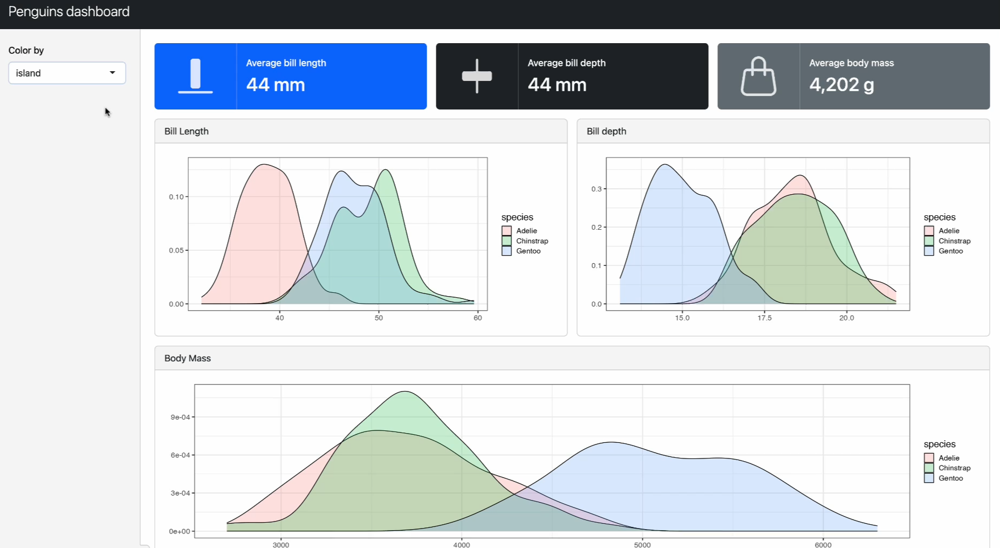
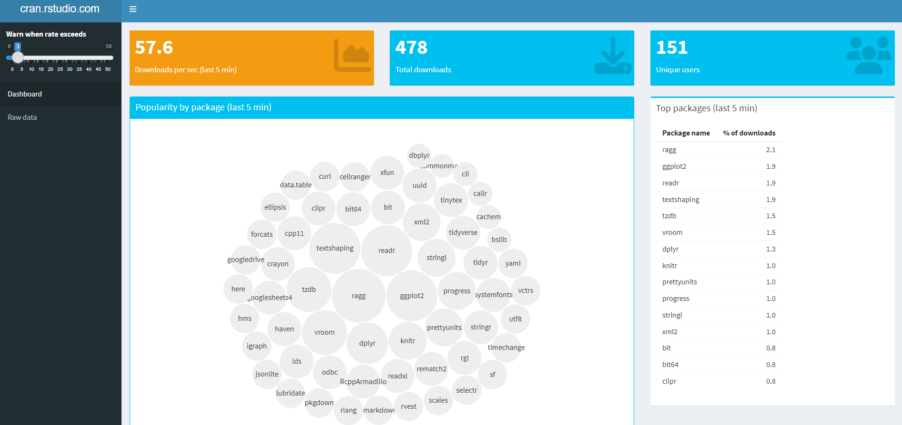
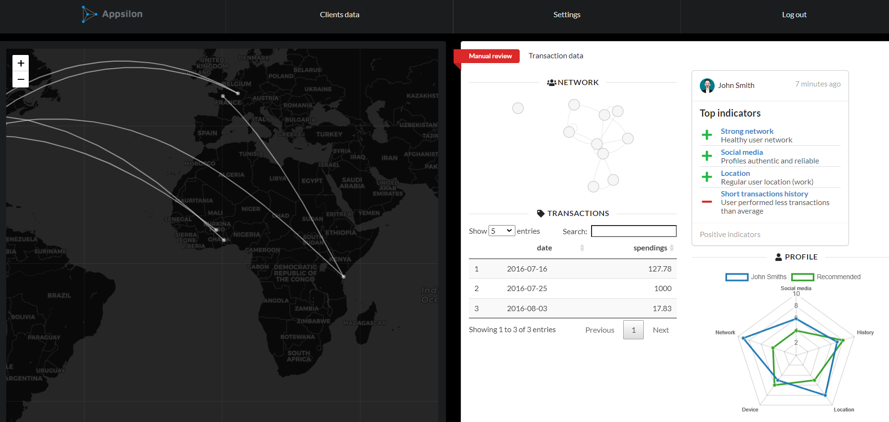
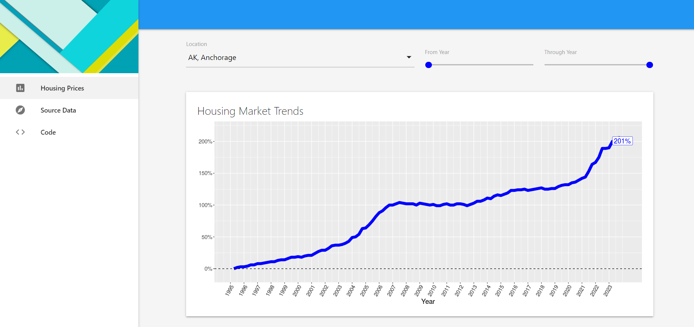
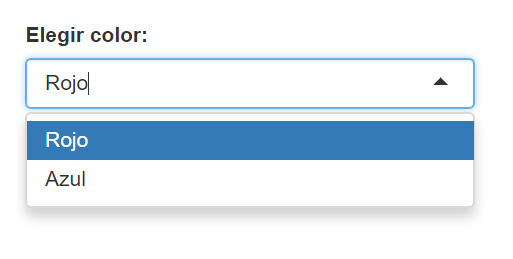
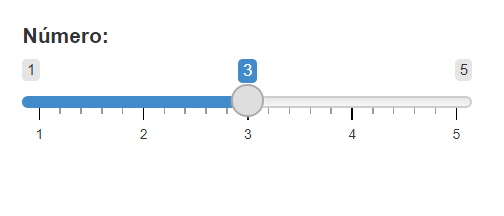
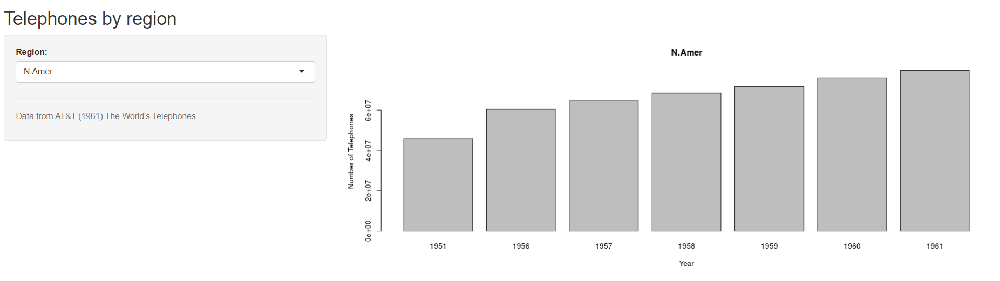
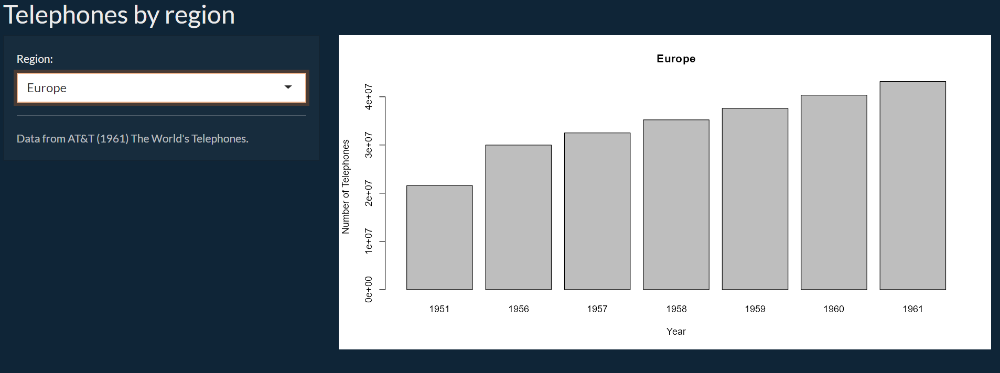
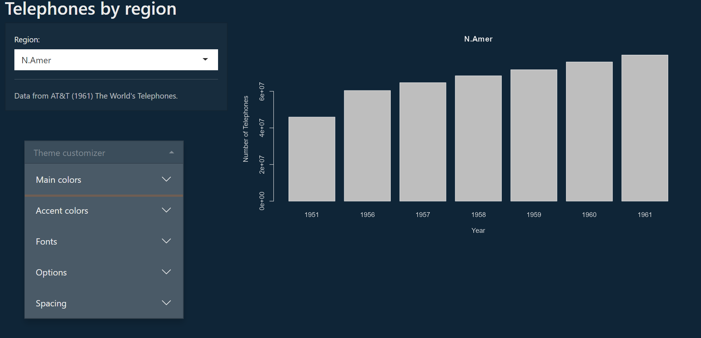
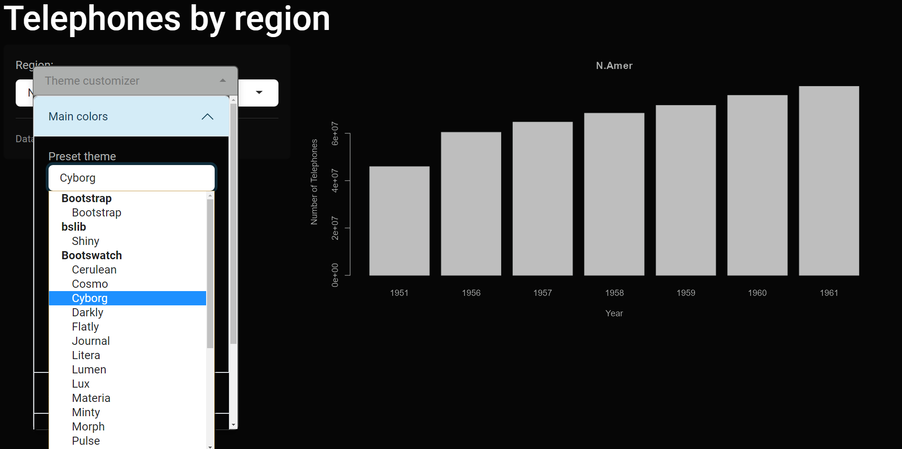

```{r include=FALSE}
knitr::opts_chunk$set(echo = FALSE)
```


# User Interface (UI)

<br>

### ¿Por dónde empiezo mi app?

Pensar cómo lucirá nuestra app, su estructura y visualizaciones es un buen inicio. Plasmar estas ideas en un boceto nos ayudará a ordenarnos y a ordenar nuestro código.

<br>

### Componentes principales de una UI

- Framework

- Layout

- Outputs

- Inputs

- Themes

---
class: center, middle inverse

# Framework

---

# Framework

<br>

Shiny usa el marco de trabajo o *framework* llamado Bootstrap (BS), el cual constituye una colección de convenciones HTML, estilos CSS y fragmentos JS agrupados en un formato determinado enfocado en el diseño.

Conocer Bootstrap nos permite ir un poco más allá de la apariencia básica que nos ofrecen las funciones de Shiny para:

- Potenciar nuestra UI utilizando el paquete `bslib` (última versión de BS)

- Manipular las clases (CSS) para personalizar nuestros componentes

- Generar nuestras propias funciones de elementos UI

<br>

[Sitio de Bootstrap](https://getbootstrap.com/)

<br>

Existen otros *framework* como [shinydashboard](https://rstudio.github.io/shinydashboard/), [shiny.semantic](https://appsilon.github.io/shiny.semantic/), [shinymaterial](https://ericrayanderson.github.io/shinymaterial/) o [shinymobile](https://rinterface.github.io/shinyMobile/)

---

class: split-four

# Framework: ejemplos

<br>

.pull-left[
Bootstrap (bslib)
[](https://shiny.posit.co/blog/posts/bslib-dashboards/)
]

.pull-right[
Dashboard
[](https://gallery.shinyapps.io/087-crandash/)
]


.pull-left[
Semantic
[](https://demo.prod.appsilon.ai/flights_fraud_demo/)
]

.pull-right[
Material
[](https://ericrayanderson.github.io/shinymaterial_showcase/)
]

---

# Framework

<br>

```{r fig.align='center', out.width="30%"}
knitr::include_graphics("recursos/atencion.png")
```

<br>

Recientemente, Shiny incorporó `bslib` en su documentación oficial por lo que muchas funciones de base fueron reemplazadas por una versión de este paquete. En este curso nos centraremos en la nueva versión, aunque en algunos casos veremos ejemplos de shiny base ya que mucho del material y el código de aplicaciones desarrolladas se mantiene con la anterior versión.

---

class: center, middle inverse

# Layout

---

# Layout

<br>

Podemos entender al layout como nuestra estructura de jerarquías base para la organización de la UI.

`bslib` provee funciones para construir layouts modernos:

- `page_fluid()` crea el lienzo en blanco el cual consiste en filas que incluyen columnas, formando una cuadrícula de 12 unidades de ancho. Una page_fluid escala sus componentes para que se adapten al tamaño de la pantalla. Configura el marco de trabajo que Shiny necesita para que los elementos se visualicen correctamente. Alternativas: `page_fixed()` y `page_fillable()`

- `page_sidebar()` página con barra lateral. Generalmente se ubican *inputs*.

- `page_navbar()` página con barra horizontal para navegación. 

 - `nav_panel()`
 - `nav_menu()`
 - `nav_item()`


- `navset_tab()`/`navset_pill()` contenedor de paneles (tabs horizontales/verticales)

- `layout_column()` controla el ancho de los componentes por fila.

---

# page_sidebar

<br>
<br>

.pull-left[
```{r echo=TRUE, warning=FALSE, message=FALSE}

library(bslib)

ui <- page_sidebar(
  title = "bslib app",
  sidebar = "Sidebar", 
  "Contenido"
)
```
]

.pull-right[
```{r}
ui
```
]

---

# Secciones múltiples

<br>

Si nuestra app va a abarcar mucho contenido o temas diversos podemos utilizar un *layout* que nos permita navegar por distintas secciones y organizar nuestra UI. Cabe aclarar que **no van a ser páginas separadas, sino paneles contenidos bajo la misma URL de la app**.

<br>
<br>

.pull-left[
```{r echo=TRUE, warning=FALSE, message=FALSE}
ui <-page_navbar(
  title = "Navbar page",
  
  nav_panel("Panel 1", "..1"),
  nav_panel("Panel 2", "..2")
)
```
]

.pull-right[
```{r}
ui
```
]

---


```{r echo=TRUE, warning=FALSE, message=FALSE}
ui <- page_navbar(
  title = "Navbar page",
  sidebar = "Sidebar",
  
  nav_panel("Panel 1", "..1"),
  nav_menu("Panel 2", 
           nav_panel("Menú 1", "Contenido del menú 1"),
           nav_panel("Menú 2", "Contenido del menú 2")
           )
)
```


```{r}
ui
```


---


```{r echo=TRUE, warning=FALSE, message=FALSE}
ui <-page_navbar(
  title = "Navbar page",
  sidebar = "Sidebar",
  
  navset_tab(
  nav_panel("Panel 1", "..1"),
  nav_panel("Panel 2", 
            navset_card_underline(title = "Opciones de panel 2",
                                  nav_panel("A", "..2a"),
                                  nav_panel("B", "..2b")
                                  )
            )
  )
)
```

```{r}
ui
```

---
# Layout con `bslib`

<br>

Además de un aspecto más moderno, `bslib` incorpora algunos elementos interesantes para construir layouts que no eran tan accesibles con Shiny base como:

- `cards`

```{r warning=FALSE, message=FALSE}
card(
  card_header("Título"),
  card_body("Contenido")
)
```

- `valueBox`

```{r warning=FALSE, message=FALSE}
library(bsicons)

value_box(
  title = "Título",
  value = "99%",
  showcase = bs_icon(name = "geo"),
  "Interesante"
)
```


---

# Layout con `bslib`

<br>

- `accordion`

```{r warning=FALSE, message=FALSE}
accordion(
  accordion_panel(
    "Controles A",
    "Contenido"
  ),
  accordion_panel(
    "Controles B", 
    "Contenido"
  )
)
```

---

# layout_columns

<br>

```{r echo=TRUE, warning=FALSE, message=FALSE}
ui <-page_fluid(
  title = "Página A",
  
  layout_columns(
    
    value_box(
      title = "Value 1",
      value = "99%",
      showcase = bs_icon(name = "geo"),
      "Interesante"
    ),
    
    
    value_box(
      title = "Value 2",
      value = "12%",
      showcase = bs_icon(name = "geo"),
      "No tan interesante"
    )
  )
)
```

---

<br>

```{r}
ui
```

---

<br>

```{r echo=TRUE, warning=FALSE, message=FALSE}
ui <-page_fluid(
  title = "Página A",
  
  layout_columns(col_widths = c(4, 8),
    
    value_box(
      title = "Value 1",
      value = "99%",
      showcase = bs_icon(name = "geo"),
      "Interesante"
    ),
    
    
    value_box(
      title = "Value 2",
      value = "12%",
      showcase = bs_icon(name = "geo"),
      "No tan interesante"
    )
  )
)
```

---
<br>

```{r}
ui
```

---

# Layout con Shiny base:

<br>

- `fluidPage()`

- `titlePanel()` define un título para la página.

- `sidebarLayout()` crea una página con una barra lateral y un panel principal:

 - `sidebarPanel()` barra lateral. Generalmente se ubican *inputs*.

 - `mainPanel()` panel principal. Generalmente se ubican *outputs*.

- `fluidRow()` controla la organización de los componentes por fila.

- `column()` controla el ancho de los componentes por fila.

---

# Página con barra lateral

<br>

.pull-left[
```
fluidPage(
  titlePanel(
    "Mi título"
  ),
  sidebarLayout(
    sidebarPanel(
      # inputs
    ),
    mainPanel(
      # outputs
    )
  )
)
```
]

.pull-right[

Fuente: https://mastering-shiny.org/action-layout.html#page-with-sidebar
]

---

# Página con filas y columnas

<br>

.pull-left[
```
fluidPage(
 
 fluidRow(
 
  column(4, ...), 
  column(8, ...)
  
 ),
 
 fluidRow(
 
  column(6, ...), 
  column(6, ...)
 )
 
)
```
]

.pull-right[

Fuente: https://mastering-shiny.org/action-layout.html#multi-row
]

---

# Secciones múltiples

<br>

Las opciones de base son:

- `tabsetPanel()` 
 - horizontal
 

- `navlistPanel()` 
 - vertical


- `navbarPage()` 
 - horizontal
 - alternativa a `fluidPage()`

--

<br>

Las cuales combinamos con:

- `tabPanel()`
- `navbarMenu()`

---

# tabsetPanel

.pull-left[
```{r echo=TRUE, warning=FALSE}

library(shiny)

ui <- fluidPage(
  
  tabsetPanel(
    tabPanel("tab 1", "..1"),
    tabPanel("tab 2", "..2")
  )
)
```
]

.pull-right[
```{r}
ui
```
]

.pull-left[
```{r echo=TRUE}
ui <- fluidPage(
  
  sidebarLayout(
    sidebarPanel("Barra"),
    mainPanel(
      tabsetPanel(
        tabPanel("tab 1", "1"),
        tabPanel("tab 2", "2"))
    )
  )
)
```
]

.pull-right[
```{r}
ui
```
]

---

# navlistPanel

<br>

.pull-left[
```{r echo=TRUE}
ui <- fluidPage(
  
  navlistPanel(
    tabPanel("tab 1", "..1"),
    tabPanel("tab 2", "..2")
  )
)
```
]

.pull-right[
```{r}
ui
```
]

---

# navbarPage

<br>

.pull-left[
```{r echo=TRUE}
ui <- navbarPage(
  title = "Título",
  
  tabPanel("tab 1", "..1"),
  tabPanel("tab 2", "..2"),
  
  navbarMenu(
    title = "Otros",
    tabPanel("tab 3", "..3")
  )
  
)
```
]

.pull-right[
```{r}
ui
```
]

---

# Ejercicios

<br>

--

Replique los siguientes *layouts*:

<br>

```{r}
ui <- page_navbar(title = "App increíble",
  
  nav_panel("Datos increíbles", 
           
           navset_tab(
             nav_panel("Datos A", "Acá van datos increíbles"),
             nav_panel("Datos B", "Acá van más datos increíbles")
           )
  ),
  
  nav_menu("Más", 
             
             nav_panel("Metodología","Texto con la metodología increíble"),
             nav_panel("Contacto", "Contacto de la persona increíble que desarrolló esta app"))
)

ui
```

---

```{r}
ui <- page_sidebar(title = "Página sidebar",
  
  sidebar = sidebar("Barra con inputs"),
  
  layout_columns(
    
    accordion(
      accordion_panel(
        "Info",
        "Contenido"
      ),
      accordion_panel(
        "Links", 
        "Contenido"
      )
    ),
    
    value_box(
      title = "Valor",
      value = "123",
      "Muy bueno"
    )
    
  )
)

ui
```

---

Shiny base

```{r}
ui <- fluidPage(
  
   titlePanel("App muy interesante"),
   
  navlistPanel(
    
    tabPanel("Panel con datos interesantes",
             
              sidebarLayout(
               sidebarPanel("Inputs para filtrar datos"),
             
             mainPanel(
             "Datos interesantes"
             )
             )
             ),
           
    
    tabPanel("Panel con texto aburrido",
             "Texto aburrido"
             )
    
  )
)
ui
```

---

class: center, middle inverse

# Outputs

---

# Outputs

<br>

Son las salidas que generamos con información para el usuario, principalmente las visualizaciones.

En la UI debemos definir no sólo dónde estarán ubicados estos outputs sino también de qué tipo serán (textos, gráficos, tablas, imágenes, etc). Luego, el código que genera la visualización lo escribiremos en el server u otro script.

```{r out.width="60%", fig.align = 'center'}

knitr::include_graphics("recursos/outputs.png")

```

Fuente: https://shiny.posit.co/r/getstarted/shiny-basics/lesson4/

---

# Outputs

<br>

Shiny nos provee de algunos outputs típicos pero, ¿qué sucede si quiero usar una visualización de un paquete específico?

Por ejemplo, supongamos que quiero mostrar gráficos interactivos usando `plotly`. La mayoría de las librerías vienen con una función de output específica, compatible con Shiny. En este caso: `plotly::plotlyOutput()`.

<br>

Así tenemos más ejemplos como:

- `highcharter::highchartOutput()` 

- `gt::gt_output()` 

- `reactable::reactableOutput()`

- `leaflet::leafletOutput()`

- etc.

---

# Outputs

<br>

Para definir un output en nuestra UI debemos escribir la función correspondiente y **asignarle un ID**. Todas las funciones de output mencionadas, tienen el parámetro: `outputId`. Este ID es obligatorio dado que luego lo necesitaremos para generar la visualización que queremos.

Adicionalmente, algunos output permiten pasarles parámetros de ancho y alto, entre otros.

```
page_fluid(
 
  layout_columns(dataTableOutput(outputId = "tabla1"),  
                 plotOutput(outputId = "grafico1", width = 100, height = 100)
                 )
  
 )

```
---

# Tags

<br>

En algunos casos querremos incluir elementos HTML estáticos como títulos o links, los cuales no requieren generarse mediante código de R. Para esto Shiny nos brinda funciones que son un atajo para las etiquetas HTML.

Con el objeto `tags` seguido del signo `$` podemos acceder a estas etiquetas.

.pull-left[
```

page_fluid(
h1("Título 1"),
h2("Título 2"),
h3("Título 3"),
h4("Título 4"),
h5("Título 5"),
h6("Título 6"),

tags$iframe(src = "https://estacion-r.com/")
)
```
]

.pull-right[
```{r}
page_fluid(
h1("Título 1"),
h2("Título 2"),
h3("Título 3"),
h4("Título 4"),
h5("Título 5"),
h6("Título 6"),

tags$iframe(src = "https://estacion-r.com/")
)
```

]

---

class: center, middle inverse

# Inputs

---

# Inputs

<br>

Shiny posee un conjunto de *widgets* para ofrecer interactividad: se trata de elementos web que proveen al usuario la capacidad de mandar mensajes a la aplicación, y a la aplicación, de recibir consultas del usuario. 

```{r out.width="50%", fig.align = 'center'}

knitr::include_graphics("recursos/inputs.png")

```

Fuente: https://shiny.posit.co/r/getstarted/shiny-basics/lesson3/

---

# Inputs

<br>


---

# Inputs

<br>

Al igual que un output, un input se escribe con un llamado a la función correspondiente. Se debe **asignar un ID** y demás parámetros requeridos. Por ejemplo, para un selector con dos opciones de colores:


```
selectInput(inputId = "selectorColor", #obligatorio
            label = "Elegir color:", #obligatorio
            choices = c("Rojo","Azul"), #obligatorio
            selected = "Rojo",
            multiple = F)
```



---

# Inputs

<br>

Un *slider*:

```
sliderInput(inputId = "sliderNumero", #obligatorio
            label = "Número:", #obligatorio
            min = 1, #obligatorio
            max = 5, #obligatorio
            value = 3 #obligatorio
            )
```



---

# Inputs

<br>

Recordemos que Shiny nos brinda funciones para que no tengamos que escribir el HTML, CSS o JS de estos widgets. Este es el código fuente de nuestro selector:

```{r comment=NA}
cat(as.character(selectInput(inputId = "selectorColor", #obligatorio
            label = "Elegir color:", #obligatorio
            choices = c("Rojo","Azul"), #obligatorio
            selected = "Rojo",
            multiple = F)))
```

<br>

**Nota**: corriendo nuestros inputs en consola o en un script podemos ver el código fuente que los genera

---

# Ejercicios

<br>

Con todo lo visto, crear un archivo de Shiny y escribir el código de una interfaz de usuario que tenga al menos:

<br>

- 2 secciones

- 2 outputs distintos

- 2 inputs distintos

- 2 textos

<br>

**Nota**: dejar el lado del server vacío
---

class: center, middle inverse

# Themes

---

# Themes

<br>

Si bien una app debe cumplir con el propósito de ser útil, el aspecto visual de la misma también es importante para orientar al usuario y causar un impacto positivo.

Además, a veces vamos a querer personalizar nuestra app para que se adecúe a parámetros estéticos propios o de nuestra organización (identidad de marca), con paletas de colores o fuentes predefinidas.

<br>

Tenemos tres caminos principales para modificar la estética de nuestra Shiny:

1. Utilizar un tema predefinido

2. Editar un tema predefinido

3. Crear nuestro propio tema

---

# Themes

<br>

Supongamos que tenemos esta funcional, pero poco atractiva, app:



https://gallery.shinyapps.io/064-telephones-by-region/

---

# Themes

<br>

Utilizando el paquete [`bslib`](https://rstudio.github.io/bslib/) podemos acceder rápidamente a algunos temas predefinidos de Bootstrap.

`page_fluid()` o `page_navbar()` tienen la opción de pasarle un `theme` que se aplicará a la app. Por ejemplo, `theme = bslib::bs_theme(preset = "superhero")` produce esta salida:

<br>

```{r out.width="100%"}

```

Nota: ver [`shinythemes`](https://rstudio.github.io/shinythemes/) para shiny base

---

# Themes

<br>

Podríamos modificar nuestro ggplot para que el fondo blanco no choque con el tema, pero por suerte el paquete [`thematic`](https://rstudio.github.io/thematic/index.html) hace esto por nosotros, agregando `thematic::thematic_shiny()` a nuestra app.

<br>

```{r out.width="100%"}
knitr::include_graphics("recursos/basic_ui_bs_thematic.png")
```

---

# Themes

<br>

El paquete brinda un widget para probar los temas en tiempo real, escribiendo en nuestro código:

- `bslib::bs_themer()` en algún lugar del server

<br>

.pull-left[

]

.pull-right[

]

---

# Themes

<br>

Aprovechando el widget de `bslib`, podemos jugar a cambiar colores y fuentes, para luego modificar los parámetros que querramos retocar de nuestro tema

```
bs_theme(bootswatch = "superhero",
  bg = "#0b3d91", 
  fg = "white"
)

```

o podemos crear nuestro propio tema 

```
theme <- bs_theme(bg = "#202123", 
  fg = "#B8BCC2",
  primary = "#EA80FC", 
  secondary = "#48DAC6",
  base_font = c("Grandstander", "sans-serif"), ...
)

bs_theme_preview(theme)

```

---

# Themes

<br>

Si preferimos hacer algo aún más personalizado, tenemos la opción de crear nuestro un archivo CSS y pasárselo a nuestra app.

<br>

--

.pull-left[
Nuestro styles.css

```css
body {
  background-color: red;
}
```

Nuestro código
```
fluidPage(

 includeCSS("styles.css")
 
)
```
]

--

Nuestra salida
.pull-right[


¡Claro que podemos hacer algo más lindo que poner el fondo rojo!
]

--

**Nota**: para casos puntuales podemos escribir CSS *inline* (ver https://shiny.posit.co/r/articles/build/css/)

---

# Ejercicio

<br>

1. Agregar un theme a la app previamente desarrollada

--

`theme_app/app.R`

---

# Recursos adicionales

<br>

Para consultar:

- [Blog UI con bslib](https://shiny.posit.co/r/articles/build/layout-guide/)

- [Mastering Shiny](https://mastering-shiny.org/index.html)

- [Cheatsheet de Shiny](https://rstudio.github.io/cheatsheets/shiny.pdf)

- [Outstanding User Interfaces with Shiny](https://unleash-shiny.rinterface.com/)

- [How To Make Your Shiny App Beautiful](https://www.appsilon.com/post/how-to-make-your-shiny-app-beautiful)

--

<br>

Para experimentar:

- [`designer`](https://ashbaldry.github.io/designer/)

- [`shinyUiEditor`](https://rstudio.github.io/shinyuieditor/)

- [`dashboardBuilder`](https://github.com/petergandenberger/dashboard-builder)

---

# Recursos adicionales

<br>

Para explorar:

- [`shinyWidgets` para más opciones](https://shinyapps.dreamrs.fr/shinyWidgets/)

- [`fresh` para crear temas](https://github.com/dreamRs/fresh/)

- [`imola` para Grid y Flexbox](https://www.anatomyofcode.com/imola/)

- [`shiny.fluent` para Microsoft UI](https://appsilon.github.io/shiny.fluent/index.html)

- [`lcars` para fans de Star Trek](https://github.com/leonawicz/lcars)

---

class: center, middle inverse

# Recapitulando

---

# Recapitulando

<br>

- Empezar por la UI es una buena forma de encarar un proyecto de Shiny ya que permite ordenarnos y pensar la lógica del server

--

<br>

- Una UI con un buen diseño puede marcar la diferencia en términos de impacto y usabilidad

--

<br>

- Los pasos (sugeridos) a seguir incluyen:

 1. Elegir un framework de nuestro agrado
 2. Definir un layout general para estructurar el contenido
 3. Optar por inputs y outputs acordes a nuestra idea de app
 4. Tematizar nuestra app a gusto personal/organizacional
 5. Probar, repensar y ajustar

--

<br>

- Un siguiente paso es armar un prototipo de app, para lo cual conviene adentrarnos un poco en el lado del servidor